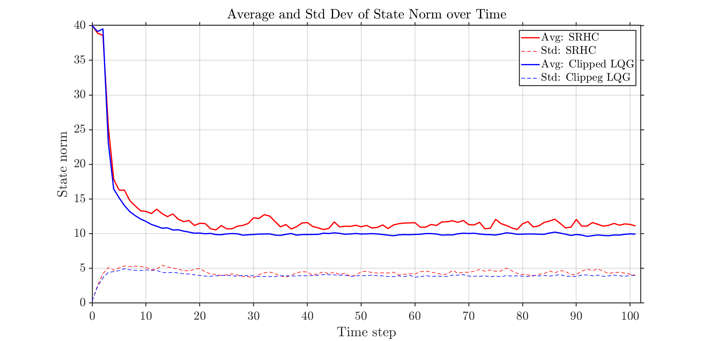

# SRHC Implementation
We have implemented the algorithm presented in the paper as a part of our course course project

## Acknowledgement :
This work was developed and proven by the authors of the paper : \
[Stochastic receding horizon control with output feedback and bounded controls](https://www.sciencedirect.com/science/article/abs/pii/S0005109811004882)
### Authors : 
* Peter Hokayem
* Eugenio Cinquemani
* Debasish Chatterjee
* Federico Ramponi
* John Lygeros

## Instructions for running the code : 
* 
* Monte carlo simulation file simulates $10^5$ trajectories to compute $\Lambda_t$ values 
